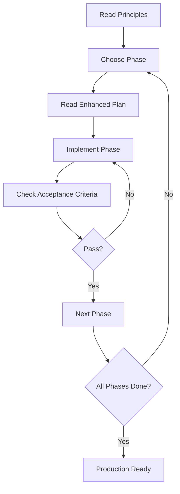

# Hybrid Temporal Memory System Architecture

**Status:** ✅ Approved for Implementation
**Version:** 2.0 (Enhanced with Validated Philosophy)
**Date:** December 10, 2025

---

## 📖 How to Use These Documents

This directory contains the complete specification for HAIA's self-evolving, self-organizing memory system. Read them in this order:

### 1️⃣ **Start Here: Philosophy & Principles**
**File:** [`memory-system-principles.md`](./memory-system-principles.md)

The "constitution" that guides all implementation decisions.

**Read this before writing any code.** It defines:
- 🔒 **5 Immutable Principles** (P1-P5) - Never violate these
- 📐 **5 Strong Guidelines** (G1-G5) - Follow unless justified deviation
- 🎨 **5 Freedom Zones** (F1-F5) - Developer's choice within constraints
- 🔍 **4 Decision Frameworks** - How to decide when plan is silent

**Key Principles:**
- **P1: Emergence Over Prescription** - "Structure emerges from data, not schemas"
- **P2: Temporal Truth** - "Memories capture beliefs at a time, not universal truth"
- **P3: Semantic Retrieval** - "Retrieval finds meaning, not exact matches"
- **P4: Graceful Degradation** - "System functions when components fail"
- **P5: Observability** - "Every decision must be explainable"

---

### 2️⃣ **Implementation Guide: Enhanced Plan**
**File:** [`implementation-plan-enhanced.md`](./implementation-plan-enhanced.md)

Detailed technical specifications for all 5 phases.

**Use this during implementation.** It contains:
- Complete code examples (2,500+ lines)
- Configuration templates
- Acceptance criteria
- Quality checkpoints
- Timeline (6-7 weeks, 42 story points)

**Phase Breakdown:**
- **Phase 1:** Temporal Foundation & BM25 (5 SP, 3-4 days)
- **Phase 2:** Dynamic Schema - LLM Entity Extraction (13 SP, 8-10 days) ← Most complex
- **Phase 3:** Hybrid Retrieval (Vector + BM25 + Graph) (8 SP, 5-6 days)
- **Phase 4:** Memory Consolidation (3-tier lifecycle) (8 SP, 5-6 days)
- **Phase 5:** Self-Organization (DBSCAN clustering) (8 SP, 5-6 days)

---

### 3️⃣ **Historical Context: Brainstorming Session**
**File:** [`../brainstorming/2025-12-10-hybrid-temporal-memory-architecture.md`](../brainstorming/2025-12-10-hybrid-temporal-memory-architecture.md)

Why we made these architectural decisions.

**Reference for rationale.** It documents:
- Problem statement (hardcoded categories, static schema)
- Research findings (Mem0, Graphiti, Neo4j MCP, 2025 best practices)
- User priorities: Accuracy > Adaptability > Cost > Speed
- Key decisions:
  - No migration needed (memory not in production)
  - APOC plugin approved for Neo4j
  - LLM costs accepted (~$0.01/memory for relationships)
  - Semantic clustering with emergent taxonomy

---

## 🎯 Quick Reference: What's Changed

### From Session 1-9 → Session 10+

| Aspect | Before (Sessions 1-9) | After (Session 10+) |
|--------|-----------------------|---------------------|
| **Memory Categories** | 5 hardcoded types (Literal enum) | ∞ dynamic types (LLM-generated) |
| **Entity Types** | 7 hardcoded node labels | Dynamic, emergent types |
| **Relationships** | 9 hardcoded (OWNS, PREFERS, etc.) | LLM-inferred, any type |
| **Retrieval** | Vector-only (Session 8-9) | Hybrid (Vector + BM25 + Graph via RRF) |
| **Memory Lifecycle** | Flat (all memories equal) | 3-tier (short-term → long-term → archived) |
| **Organization** | Manual categorization | Self-organizing (DBSCAN clustering) |
| **Temporal Tracking** | Single timestamp (created_at) | Bi-temporal (valid_from/until, learned_at) |
| **Contradiction Handling** | Undefined | Automatic temporal resolution (old memories preserved) |
| **Type Consistency** | Enforced via enums | Semantic clustering (emergent taxonomy) |

---

## 🔄 Workflow: From Spec to Implementation



**Step-by-Step:**
1. Read `memory-system-principles.md` (one-time, ~30 min)
2. Pick a phase from `implementation-plan-enhanced.md`
3. Implement services using code examples
4. Validate against acceptance criteria
5. Run quality checkpoints
6. Repeat for next phase

---

## 🚀 Getting Started: Phase 1

**Ready to implement immediately:**

1. **Read the Philosophy**
   ```bash
   cat docs/architecture/memory-system-principles.md | less
   ```

2. **Jump to Phase 1**
   - File: `implementation-plan-enhanced.md` (lines 21-305)
   - Effort: 5 story points (3-4 days)
   - Risk: Low
   - Dependencies: None

3. **Key Deliverables:**
   - Bi-temporal properties added to Memory nodes
   - BM25 full-text index created
   - `ExtractedMemory` model updated (no Literal constraint)
   - Temporal queries working

4. **Acceptance Test:**
   ```bash
   # Run after Phase 1 implementation
   pytest tests/phase1/ -v
   ```

---

## 📊 Expected Outcomes (After Phase 5)

Based on industry research benchmarks:

| Metric | Current (Session 9) | Target (Session 10+) | Improvement |
|--------|---------------------|----------------------|-------------|
| **Accuracy** | Baseline | +26% | Mem0 benchmark |
| **Memory Types** | 5 hardcoded | Infinite dynamic | LLM-driven |
| **Retrieval Latency** | ~1-2s | <300ms (p95) | Graphiti benchmark |
| **Token Cost** | Baseline | -90% | Mem0 benchmark |
| **Adaptability** | Fixed schema | Self-organizing | Emergent themes |
| **Recall** | Vector-only baseline | +15-20% | Hybrid retrieval |

---

## 🛠️ Development Workflow

### Daily Checklist
- [ ] Review relevant principles for today's work (5 min)
- [ ] Check acceptance criteria before starting (2 min)
- [ ] Reference code examples from enhanced plan
- [ ] Log all decisions (P5: Observability)
- [ ] Test graceful degradation (P4)
- [ ] Validate against philosophy (end of day)

### Weekly Checkpoints
- [ ] Phase acceptance criteria met?
- [ ] Quality checkpoint passed?
- [ ] Manual validation complete?
- [ ] Documentation updated?

---

## 📝 Validation Philosophy

From `memory-system-principles.md`:

> **Before implementing any feature, ask:**
> - [ ] Does this violate any Tier 1 Principles? (If yes, redesign)
> - [ ] Does this follow Tier 2 Guidelines? (If no, justify deviation)
> - [ ] Is there Tier 3 Freedom here? (If yes, choose best approach)
> - [ ] Does this decision fit a Tier 4 Framework? (If yes, apply framework)
> - [ ] Is this decision observable? (Can user understand why?)
> - [ ] Does this degrade gracefully? (What if it fails?)

---

## 🔗 Related Documents

### In This Repository
- [`CLAUDE.md`](../../CLAUDE.md) - Project overview for Claude Code
- [`ROADMAP.md`](../../ROADMAP.md) - Overall project roadmap

### External References
- [Mem0 Architecture](https://docs.mem0.ai/architecture) - Hybrid datastore inspiration
- [Graphiti](https://github.com/getzep/graphiti) - Temporal graph memory
- [Neo4j MCP Best Practices](https://github.com/neo4j-contrib/mcp-neo4j) - LLM-first intelligence
- [PydanticAI Documentation](https://ai.pydantic.dev/) - Agent framework

---

## 📧 Questions?

If you encounter:
- **Principle conflicts** → Re-read `memory-system-principles.md` examples
- **Implementation ambiguity** → Check decision frameworks (Tier 4)
- **Technical blockers** → Review enhanced plan code examples
- **Philosophy questions** → Consult brainstorming doc for rationale

---

## ✅ Document Status

| Document | Status | Last Updated | Purpose |
|----------|--------|--------------|---------|
| `memory-system-principles.md` | ✅ Approved | 2025-12-10 | Philosophy |
| `implementation-plan-enhanced.md` | ✅ Approved | 2025-12-10 | Technical specs |
| `../brainstorming/...md` | ✅ Complete | 2025-12-10 | Context |

**Next Review:** After Phase 2 completion (validate principles held up in practice)

---

**Ready to build!** 🚀

Start with Phase 1: [`implementation-plan-enhanced.md`](./implementation-plan-enhanced.md#phase-1-temporal-foundation--bm25-search)
